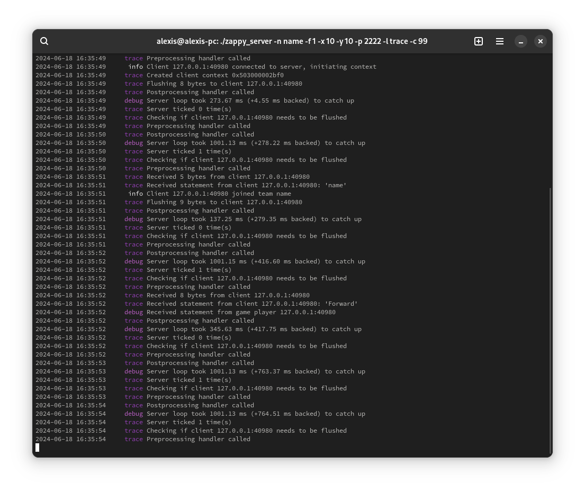
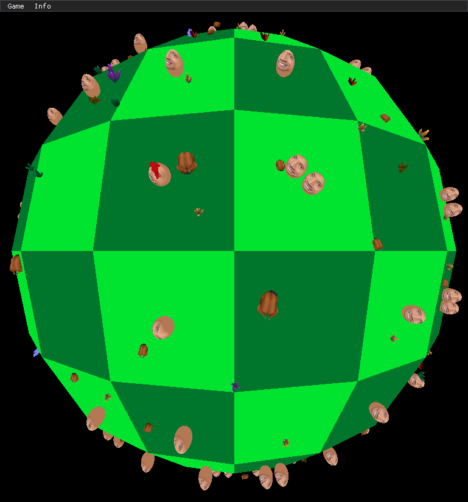
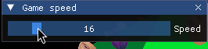

# Zoat

## Table of Contents

- [Zoat](#zoat)
  - [Table of Contents](#table-of-contents)
  - [Introduction](#introduction)
    - [Purpose](#purpose)
    - [Components](#components)
      - [Server](#server)
      - [Watcher](#watcher)
      - [Player](#player)
  - [Implementation](#implementation)
    - [Overview](#overview)
  - [Build & Run](#build--run)
    - [Prerequisites](#prerequisites)
      - [Required Environment](#required-environment)
      - [Required Tools](#required-tools)
      - [Required Dependencies](#required-dependencies)
    - [Build the Project](#build-the-project)

## Introduction

### Purpose

Zoat is an implementation of Epitech's Zappy project where Trantorians, an extraterrestrial population living on a
donut-shaped planet, have a goal to elevate themselves through different levels until reaching level 9.

At their disposal is a good amount of resources (such as food, linemate, sibur, etc.) and a set of actions that they
can perform sequentially. The game is played in real-time, controlled by a frequency of ticks per second.

All Transorians are split into teams and have to cooperate to reach the highest level possible. The game is won when
a team reaches level 9.

### Components

The project consists of

 - [a server](#server), written in C, exhibiting the behaviour of the game to graphical clients (also called
   *watchers*) and AI robots (also called *players*)
 - [a graphical client](#watcher), written in C++, displaying the current state of the game, including all of the
    resources, players incantations and broadcasting messages
 - [an AI implementation](#player), written in Python, that controls one or more Trantorians in a game, and that
    has the goal of reaching the highest level possible while keeping the team alive

#### Server



The server is the main component of the project. It is responsible for managing the game state, including the map,
players, resources, teams, and game rules. It is also responsible for managing the communication between players and
watchers.

You can find the server's source code in the [`server`](/server) directory.

The server can be launched through the `zappy_server` binary. It accepts a set of options to configure the game:

```bash
$ ./zappy_server
USAGE: ./zappy_server [OPTIONS]
OPTIONS:
  -h, --help               Display this help message
  -l, --logger-level       Set the logger level threshold
  -p, --port               Set the port
  -x, --width              Set the width of the world
  -y, --height             Set the height of the world
  -n, --teams              Set the name of the teams
  -c, --client-count       Set the number of clients per team
  -f, --tick-frequency     Set the game logic frequency (in Hertz)
  -G, --sync-mode          Set the way the game state is transmitted to ('async', 'explicit')
  -s, --shitty-gui         Don't add '#' to player IDs so that the reference binary doesn't crash
```

You might be flabbergasted by the `--shitty-gui` option, but it is required to make the reference binary work since it
expects the player IDs to **not** have their integers prefixed with pound signs (`#`), unlike what has been stipulated
by the protocol.

Some arguments are mandatory, such as the name of the teams that can connect to the server or the number of clients.

#### Watcher



The watcher is a graphical client that displays the live state of the game. A watcher connects to a live server and
shows the map, players, resources, and incantations. It also displays the messages that are broadcasted by the players.

You can find the watcher's source code in the [`gui`](/gui) directory.

Just like with the server binary, the watcher binary can be launched with a set of options that's similar to the server
options (`-p` for the port, `-h` for the host address, and `-s` for the shitty GUI mode).



You can control different aspects of the server, such as how many ticks the server is running at; as well as inspecting
players' inventories and levels.

#### Player

The player is an AI implementation that controls one or more Trantorians in the game. The player is written in Python,
and uses the `socket` module to communicate with the server.

You can find the player's source code in the [`player`](/player) directory.

The player can be launched with the following command:

```bash
$ ./zappy_ai -help
usage: zappy_ai -p PORT -n NAME [-h HOST] [-help]

options:
  -p PORT, --port PORT  Server Port
  -n NAME, --name NAME  Team Name
  -h HOST, --host HOST  Server Host
  -help                 Show this help message and exit
```

## Implementation

### Overview

The project is configured through CMake, and is subdivided into three main components as aforementioned.

Each subproject has its own `CMakeLists.txt` file, and the root `CMakeLists.txt` file is responsible for configuring
the project as a whole, so that each binary can be built and run.

## Build & Run

### Prerequisites

#### Required Environment

The project has been tested on Linux, and it is recommended to use a Linux distribution to build and run the project.

The project has not been tested on Windows, and it is not guaranteed to work on Windows. If you want to build and run
the project on Windows, you can use the
[Windows Subsystem for Linux (WSL)](https://learn.microsoft.com/en-us/windows/wsl/install).

#### Required Tools

The project requires the following tools to build the project:

| Tool         | Version    |
|--------------|------------|
| `cmake`      | `>= 3.27`  |
| `make`       | `>= 4.4.1` |
| `gcc`        | `>= 14.1`  |
| `python`     | `>= 3.12`  |

 - `gcc` can be replaced with `clang` if you prefer to use `clang` as your compiler, but it has not been tested against
   the project.
 - Do note that using `ninja` instead of `make` is also supported, but it has not been tested against the project.

#### Required Dependencies

The project requires the following dependencies to build the project:

| Dependency    | Version    |
|---------------|------------|
| `glfw`        | `>= 3.4.2` |
| `sdl2`        | `>= 2.30`  |
| `sdl2_gfx`    | `>= 2.30`  |
| `sdl2_image`  | `>= 2.30`  |
| `sdl2_ttf`    | `>= 2.30`  |
| `libxrandr`   | `>= 1.5.4` |
| `libxinerama` | `>= 1.1.5` |
| `libxi`       | `>= 1.8.1` |

Do note that older versions of the dependencies might work, but they have not
been tested against the project.

### Build the Project

To build the project, you can use the [`make.sh`](/make.sh) script:

```bash
$ ./make.sh
```

This will create a `build` directory in the source tree, and run `cmake` and `make` to build the project.

Do note that the project needs external dependencies to be built as well. Thus, it is perfectly normal for `CMake` to
stay "stuck" for a while during configuration.

You can clean up the project by using the [`clean.sh`](/clean.sh) script:

```bash
$ ./clean.sh
```

This will remove the `build` directory from the source tree.
